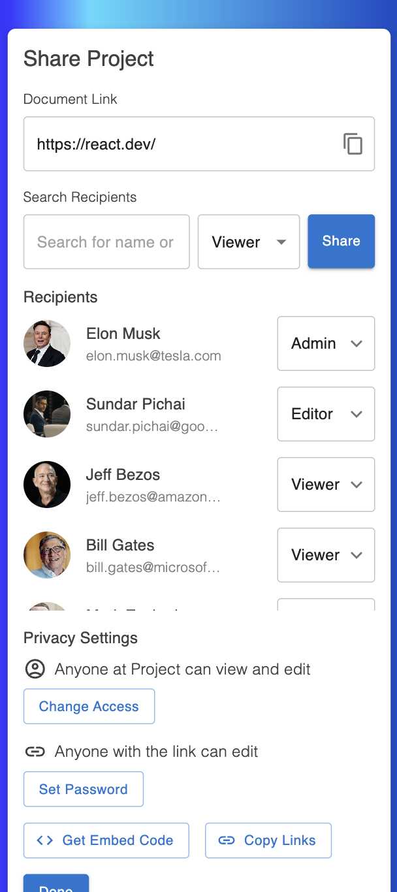

## PumpITup Technical Assignment

---

## Project Overview

This project is a **React + Material UI** based application that allows users to **share project links**, **manage
recipient
roles**, and **set privacy settings** efficiently. It follows best practices for:

- **Lazy-loading components** for performance
- **Optimizing for mobile responsiveness**
- **Form validation using React Final Form**
- **Role-based access control**
- **Enhancing UX/UI interactions** with real-time updates

---

## Installation & Setup

Follow these steps to install and run the application on your local machine:

```sh

git clone https://github.com/VladyslavAslanov/PumpITup-Technical-Assignment.git
```

```sh

cd ./PumpITup-Technical-Assignment
```

```sh

npm install
```

```sh

npm run dev
```

The frontend will now be running on `http://localhost:5137`

```
Tech Stack:

| Technology            | Usage                           |
|-----------------------|---------------------------------|
| React (TypeScript)    | Component-based architecture    |
| Material UI (MUI)     | UI components & styling         |
| React Context API     | State management for recipients |
| React Final Form      | Form validation & handling      |
| React Lazy & Suspense | Lazy loading for performance    |
| TypeScript            | Strongly-typed development      |
| ESLint & Prettier     | Code linting & formatting       |
```

<p align="center">
  
  <br>
  <i>Desktop View</i>
</p>

<p align="center">
  
  <br>
  <i>Mobile View</i>
</p>


